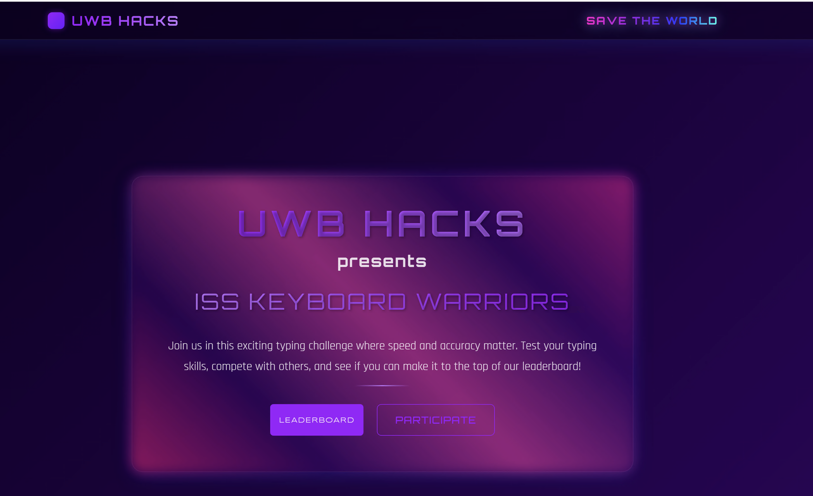
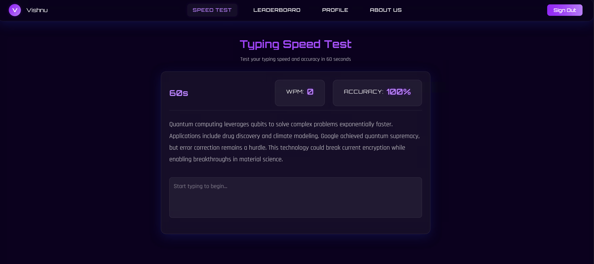
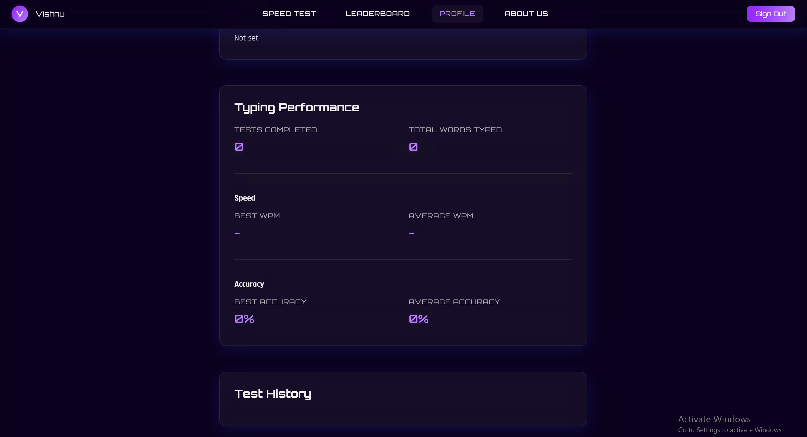
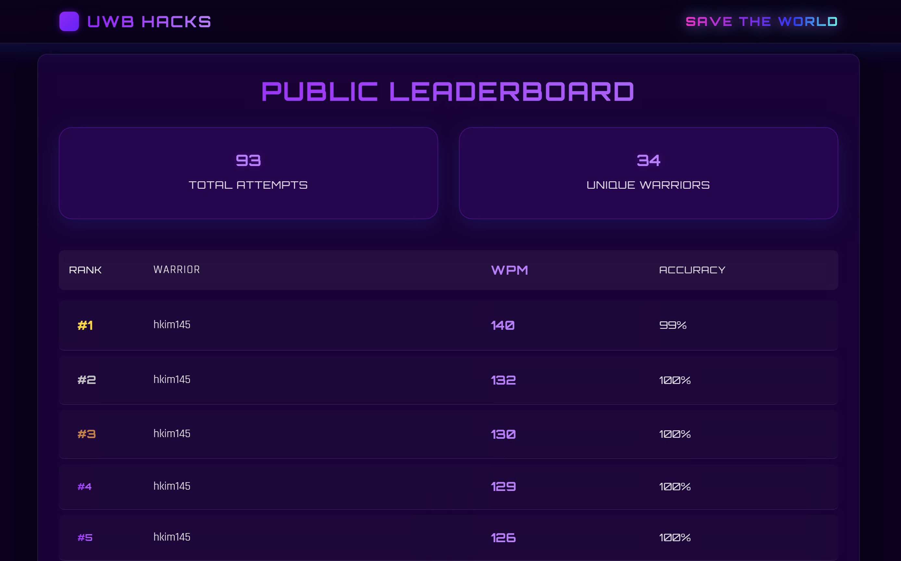

# ISS Keyboard Warriors - Typing Speed Test

A modern, interactive typing speed test application built with React and Vite, featuring user authentication, real-time typing metrics, and a global leaderboard.

<div align="center">
  
</div>

## 📋 Project Overview

ISS Keyboard Warriors is a web application developed for UWB HACKS that allows users to test and improve their typing speed and accuracy. The application features a sleek, futuristic UI with a 60-second typing challenge, real-time WPM (Words Per Minute) and accuracy tracking, and a global leaderboard to compete with other users.

### ✨ Key Features

- **60-Second Typing Test**: Test your typing speed and accuracy with a timed challenge
- **Real-time Metrics**: See your WPM and accuracy update in real-time as you type
- **User Authentication**: Secure login and registration with Clerk
- **Personal Statistics**: Track your progress and view your typing history
- **Global Leaderboard**: Compete with other users and see the top performers
- **Responsive Design**: Works on both desktop and mobile devices
- **Anti-Cheat Measures**: Prevents copying/pasting and detects developer tools

## 🛠️ Technology Stack

- **Frontend**: React 19, React Router 7
- **Build Tool**: Vite 6
- **Authentication**: Clerk
- **Database**: Supabase
- **Styling**: CSS with custom variables and animations
- **Animation**: Framer Motion

## 🚀 Getting Started

### Prerequisites

- Node.js (v18.0.0 or higher)
- npm or yarn
- Supabase account
- Clerk account

### Environment Variables

Create a `.env` file in the root directory with the following variables:

```
VITE_CLERK_PUBLISHABLE_KEY=your_clerk_publishable_key
VITE_SUPABASE_URL=your_supabase_url
VITE_SUPABASE_ANON_KEY=your_supabase_anon_key
```

### Database Setup

1. Create a new Supabase project
2. Create a `typing_results` table with the following schema:
   - `id` (auto-incrementing primary key)
   - `user_email` (text)
   - `wpm` (integer)
   - `accuracy` (float)
   - `total_words` (integer)
   - `timestamp` (timestamp with timezone)

### Installation

1. Clone the repository
   ```bash
   git clone https://github.com/KandalaV21/keyboardwarriors.git
   cd iss-keyboard-warriors
   ```

2. Install dependencies
   ```bash
   npm install
   # or
   yarn
   ```

3. Start the development server
   ```bash
   npm run dev
   # or
   yarn dev
   ```

4. Open your browser and navigate to `http://localhost:5173`

## 📦 Build for Production

```bash
npm run build
# or
yarn build
```

The build artifacts will be stored in the `dist/` directory.

## 🧪 Project Structure

```
typing-main/
├── public/
├── src/
│   ├── components/
│   │   ├── about/
│   │   ├── auth/
│   │   ├── dashboard/
│   │   ├── layout/
│   │   ├── public/
│   │   └── typing/
│   ├── lib/
│   │   └── supabase.js
│   ├── utils/
│   │   └── devtools-detect.js
│   ├── App.jsx
│   ├── App.css
│   ├── index.css
│   └── main.jsx
├── .env
├── .gitignore
├── eslint.config.js
├── index.html
├── package.json
├── README.md
└── vite.config.js
```

## 🔑 Core Components

### Typing Test

The core typing test functionality is implemented in `src/components/typing/TypingTest.jsx`. It includes:

- A 60-second timer that starts when the user begins typing
- Real-time calculation of WPM and accuracy
- Character-by-character validation with visual feedback
- Multiple text samples that rotate when the current one is completed
- Result saving to Supabase when the test is complete


### Authentication

User authentication is handled by Clerk, with protected routes implemented in `src/components/auth/ProtectedRoute.jsx`. The dashboard and user-specific features are only accessible to authenticated users.

### Dashboard

The dashboard provides access to:
- The typing speed test
- User profile with typing history and statistics
- Leaderboard showing top performers
- About section with information about the project

<div align="center">
  
  <p><em>The dashboard interface with navigation</em></p>
</div>

### Profile

The profile page displays the user's typing statistics and history:

<div align="center">
  
  <p><em>User profile showing typing statistics and history</em></p>
</div>

### Leaderboard

The leaderboard displays the top 10 users by WPM, with a public version accessible to non-authenticated users and a more detailed version for logged-in users.

<div align="center">
  
  <p><em>Global leaderboard showing top performers</em></p>
</div>

## 🎨 UI/UX Design

The application features a futuristic, space-themed design with:
- Custom font families (Orbitron, Syncopate, Rajdhani, Audiowide)
- Gradient text and button effects
- Glass-morphism UI elements
- Particle animations in the hero section
- Responsive layout for all device sizes

## 🤝 Contributing

Contributions are welcome! Please feel free to submit a Pull Request.

## 📄 License

This project is licensed under the MIT License - see the LICENSE file for details.

## 🙏 Acknowledgements

- UWB HACKS for the inspiration and opportunity
- [Clerk](https://clerk.dev/) for authentication
- [Supabase](https://supabase.io/) for the database
- [Vite](https://vitejs.dev/) for the build tooling
- [React](https://reactjs.org/) for the UI library

